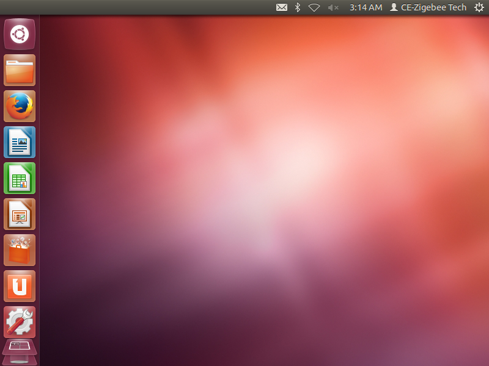
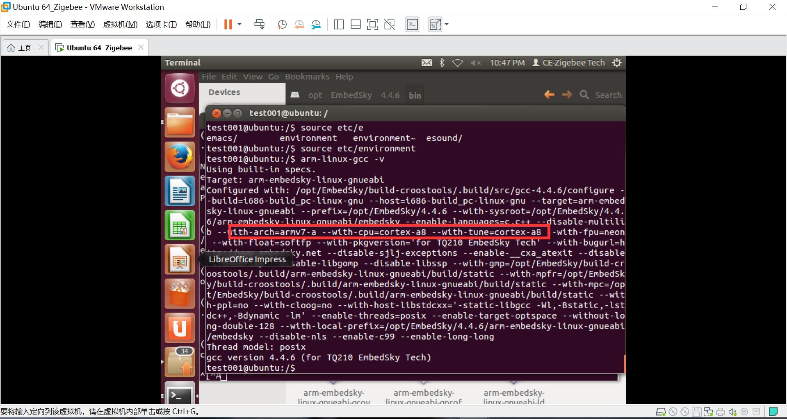
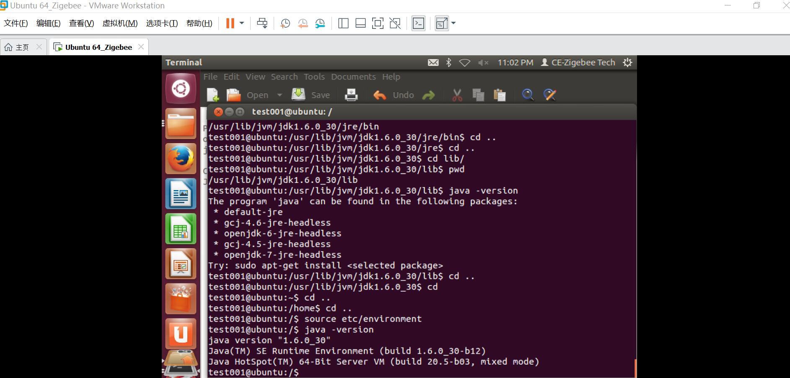
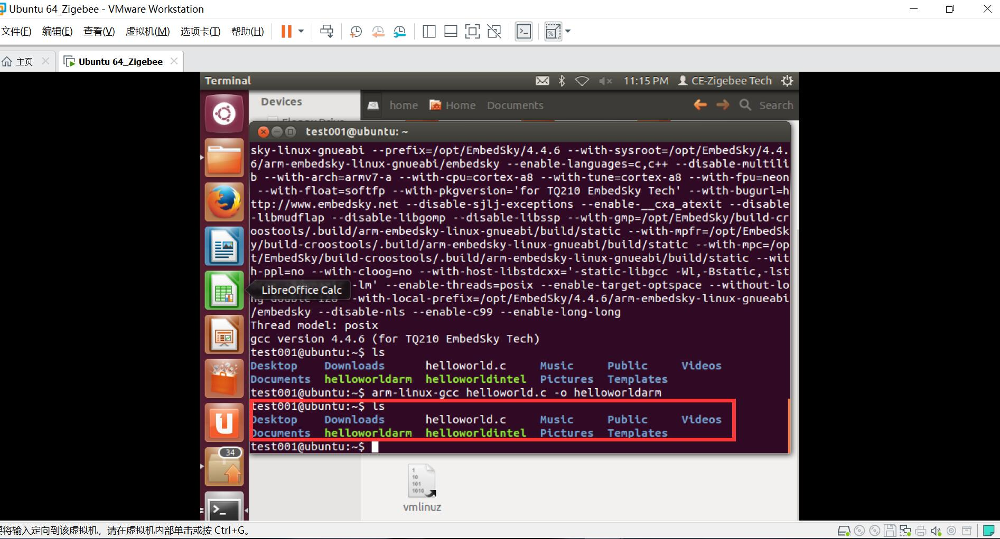
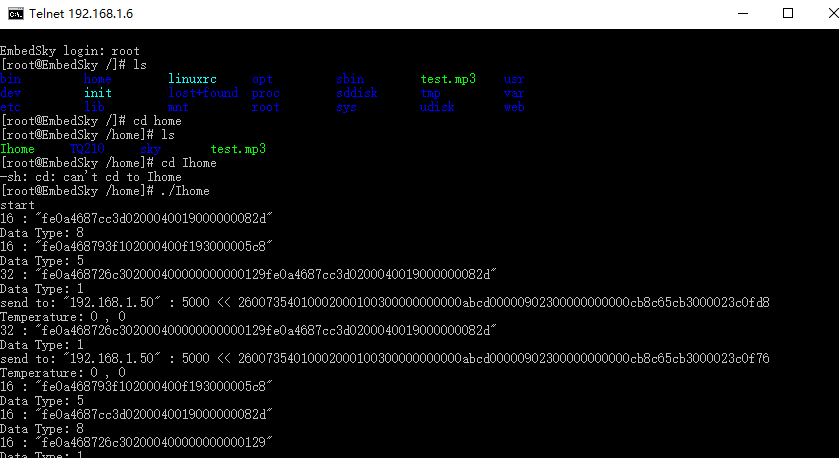
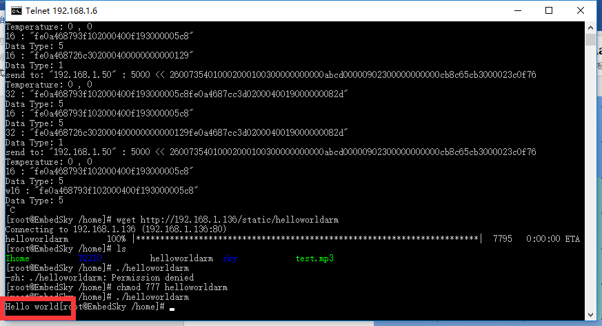

# 使用Ubuntu12.04搭建交叉编译环境  
## 1.基于Ubuntu12.04的虚拟机创建  
### 通过VMwear Wordstation pro 15创建虚拟机  
   
## 2.对Ubuntu12.04换源  
## 3.配置交叉编译环境  
    
## 4.安装JDK  
  
## 5.测试helloworld.c并进行交叉编译  
  
## 6.window平台与沙盘联动  
  
  