# 基于Google Homeassistant的智能互联设计  
## 1.引入天气传感器，天气源为DarkSky  
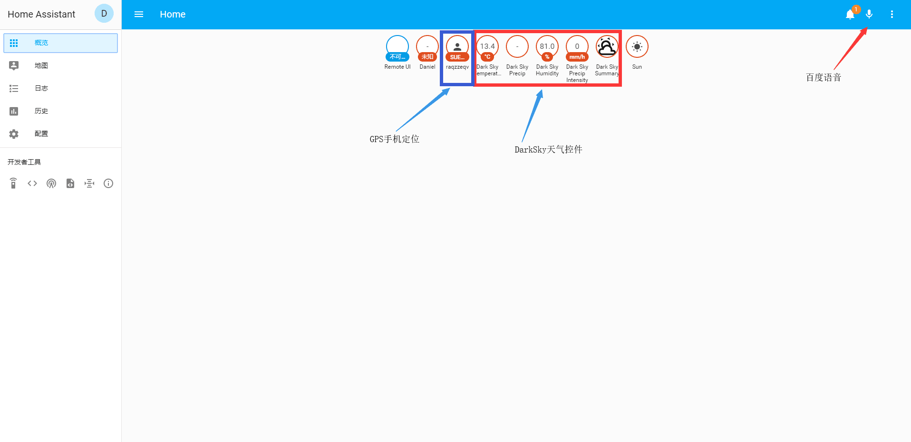   
## 2.引入地图模块   
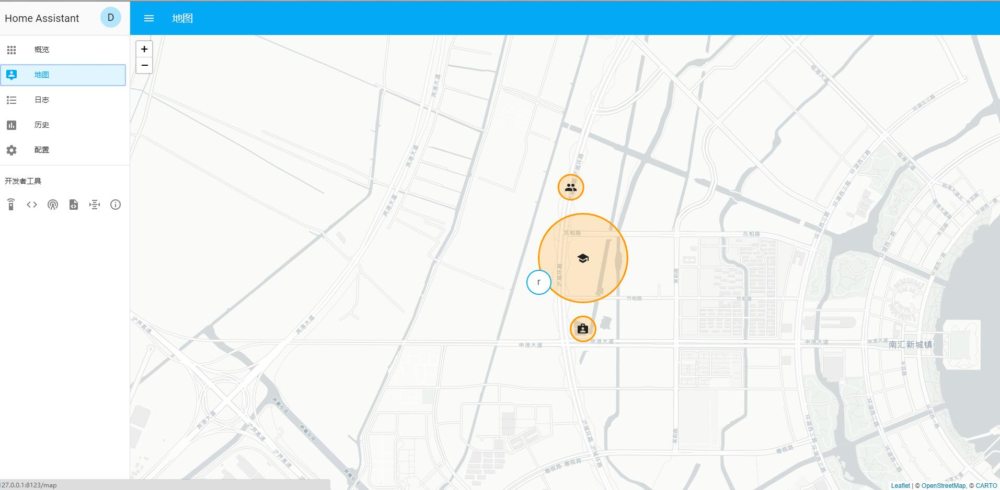    
## 3.添加iOS手机的定位服务，基于device_tracker  
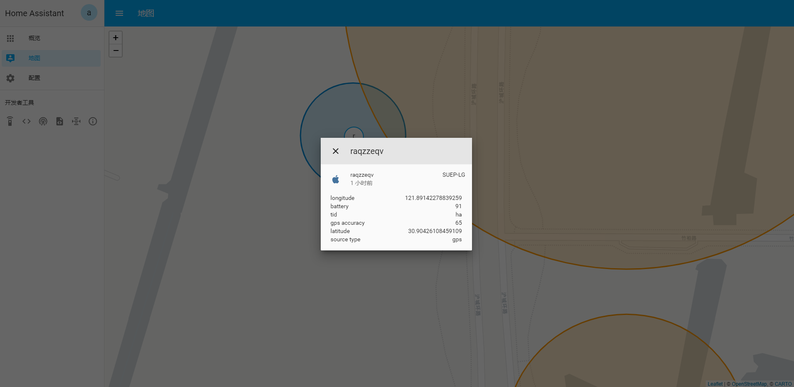 
## 4.引入MQTT服务，服务商为cloudmqtt
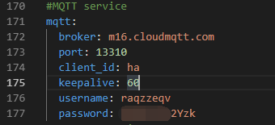  
## 5.引入消息推送服务，服务商为alterover  
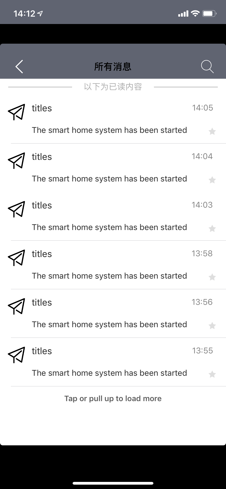  
## 6.引入短信推送服务，服务商为twilio  
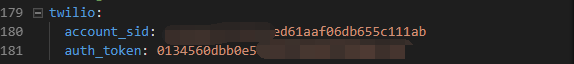 
## 7.引入区域服务，基于zone组件  
 
## 8.引入tts语音识别服务，服务商为baidu  
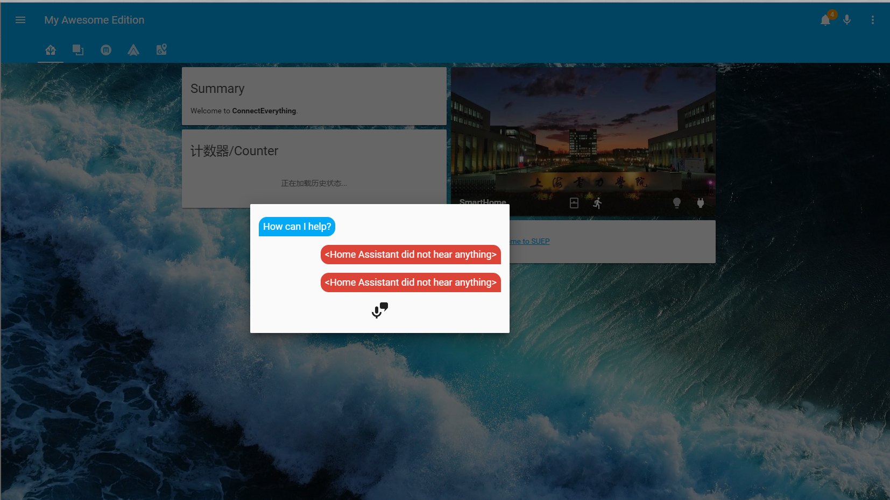 
## 9.引入媒体播放服务，服务商为vlc  
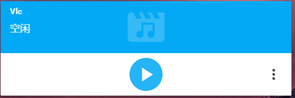 
## 10.引入本地摄像头服务，基于ffmpeg  
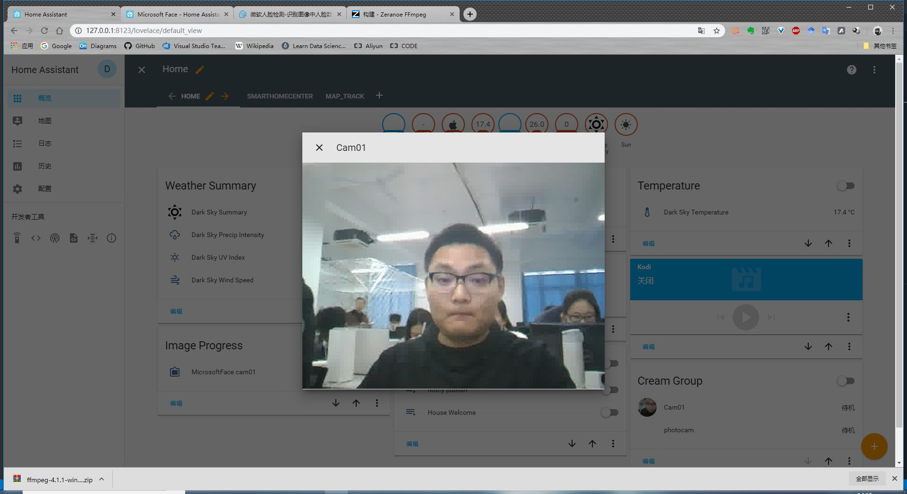 
## 11.引入网络摄像头服务，基于android_ip_webcam  
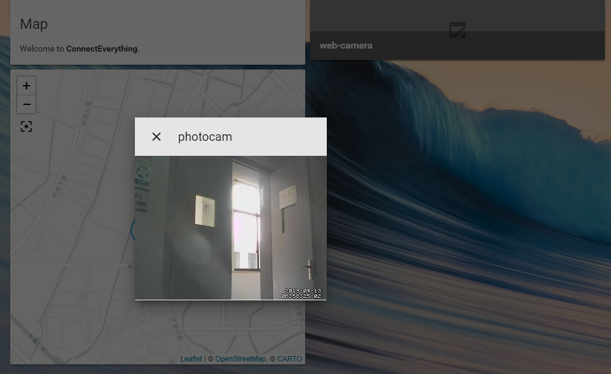 
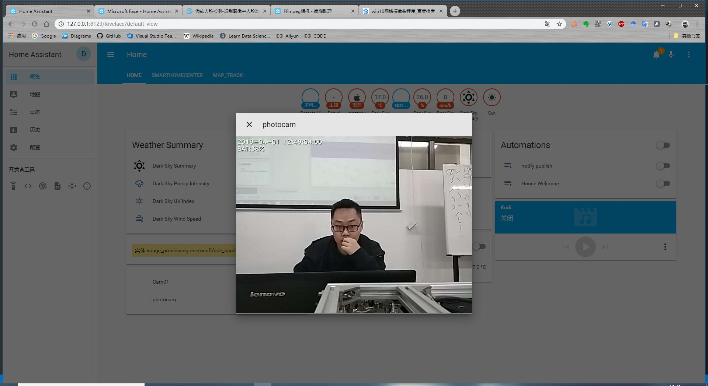 
## 12.引入人脸识别服务，基于microsoft_face
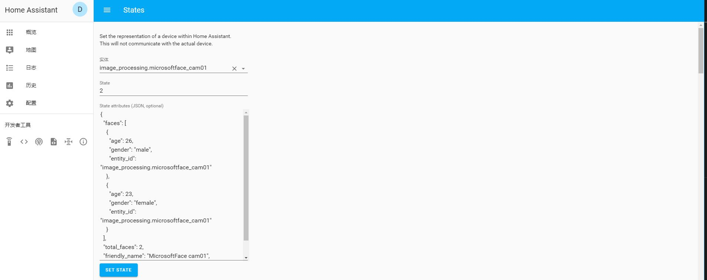 
## 13.添加自定义组件，读取USB串口数据  
 
## 14.添加自定义组件，读取HTTP下行的数据
### 基于Yolo算法的人数识别，HTTP返回值为识别人数 
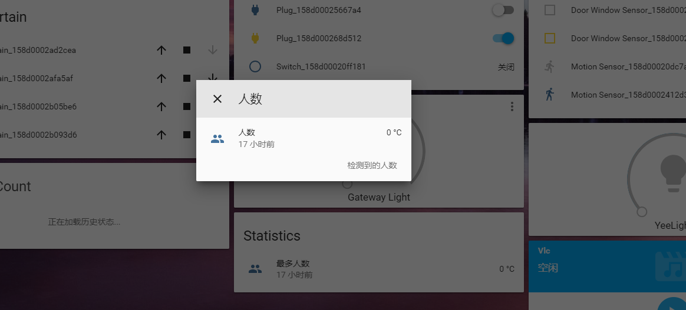 
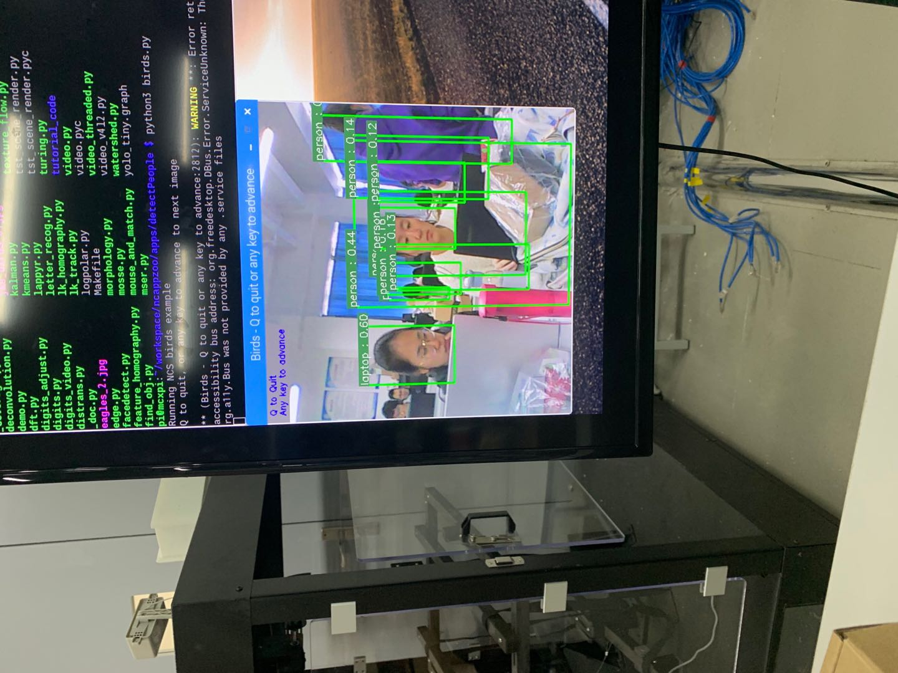 
## 15.添加自定义组件，实现累加计数器  
 
## 16.加入小米网关
### 小米网关挂载多种传感器和执行器，包括一下：
### 温湿度传感器、光照强度传感器、门窗传感器、动作传感器
### 多功能网关灯、智能窗帘、电源插座  
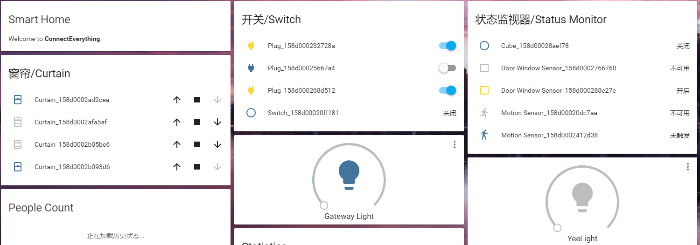 
## 17.添加数据库服务，基于recorder  
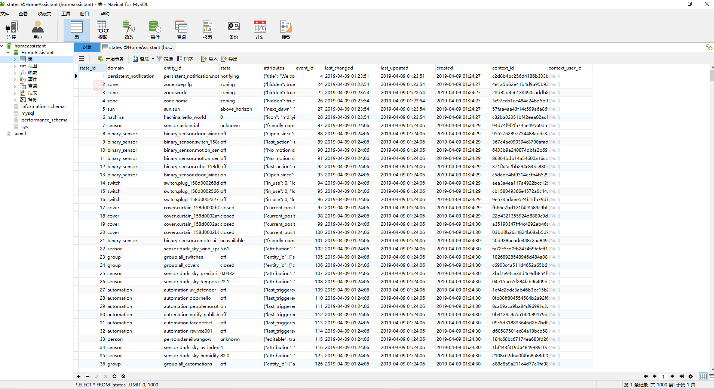 
## 18.通过yaml进行前端UI设计
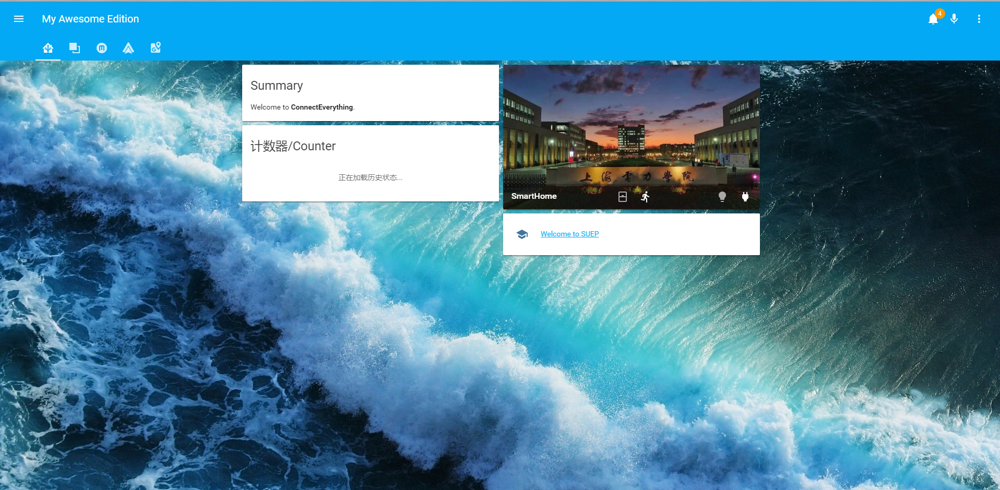 