# OLED显示屏
# 

# 无处不在的灯光1
# 

# 无处不在的灯光2
# 

# 麦克风1
# 

# python进度
# 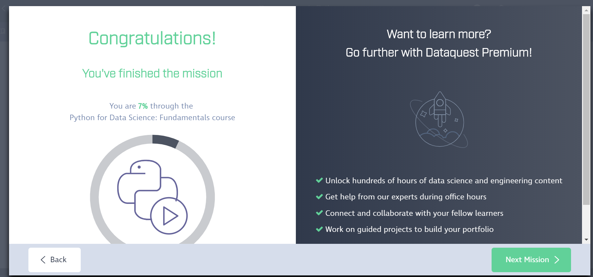

# VMware hello world.cpp
# 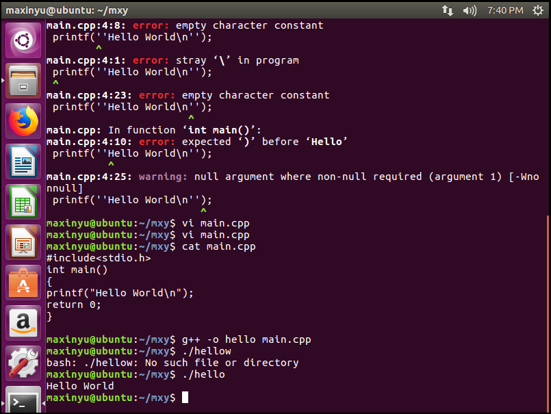

# python练习做完了进度图
# 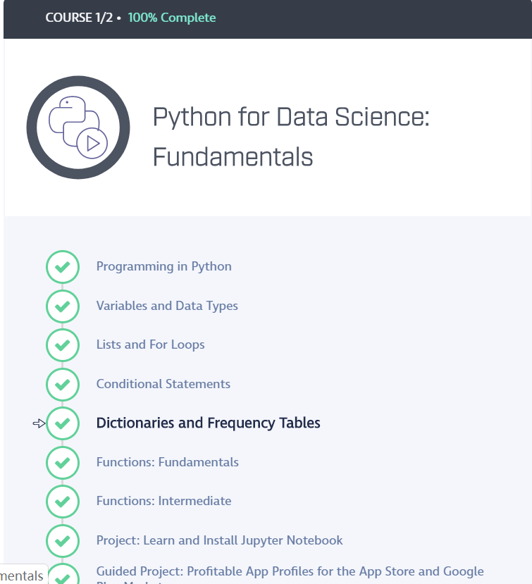

# opencv显示视频
# 

# opencv显示本地视频
# 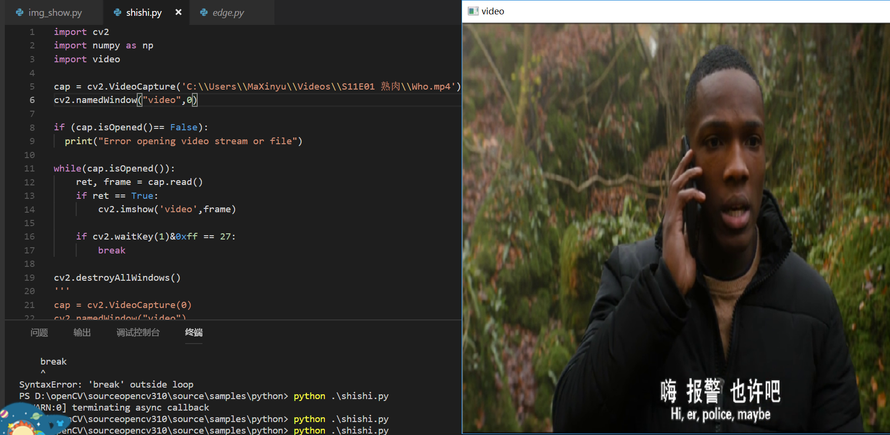

# 鼠标响应事件结果及代码
# 
# 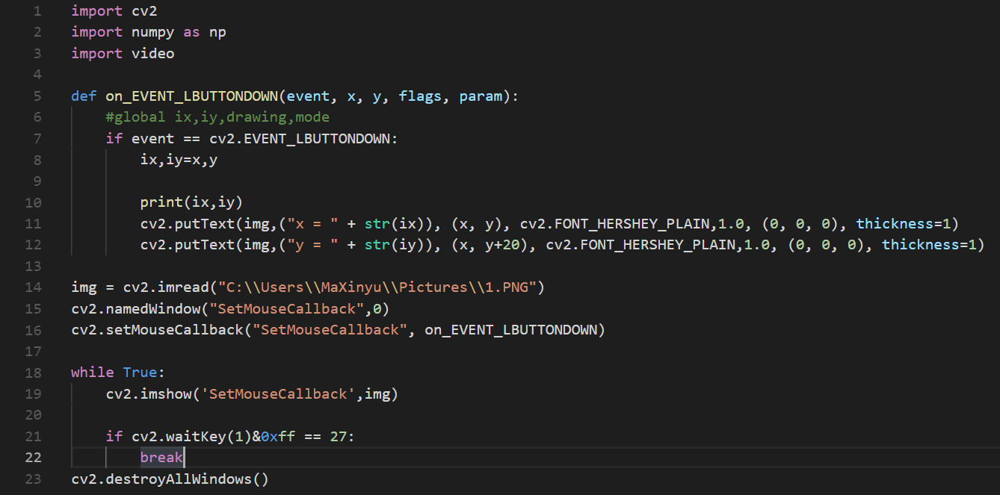

# 我的世界helloworld
# 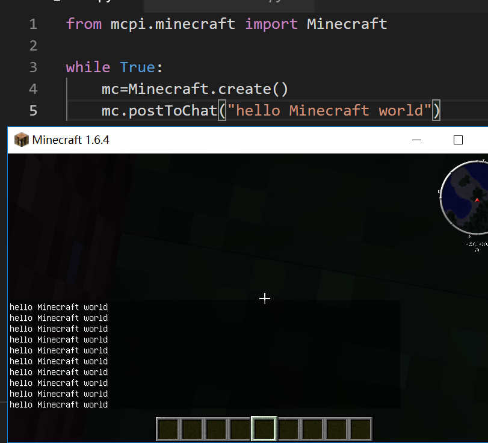

# 我的世界收取租金
# 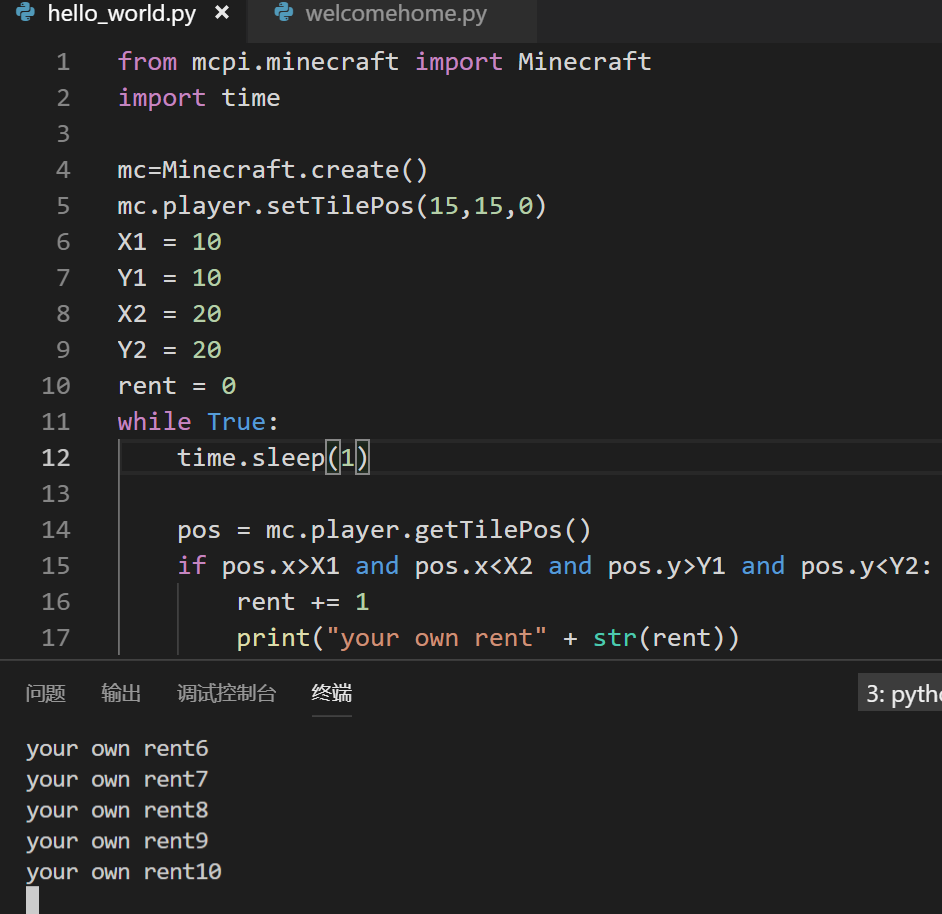

# 我的世界放置石块
# 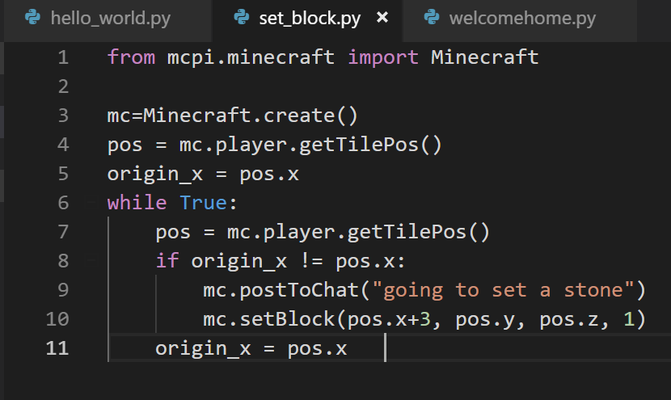

# 我的世界玩家移动
# 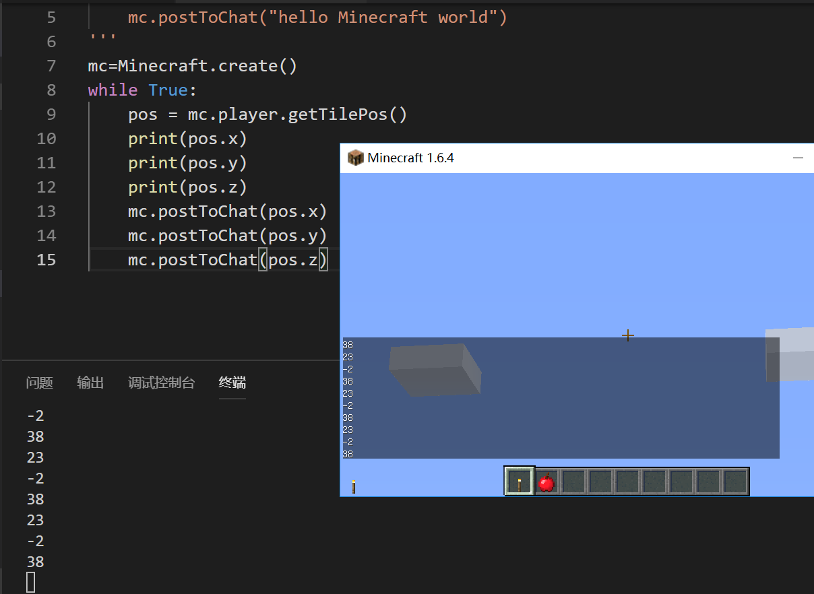
# 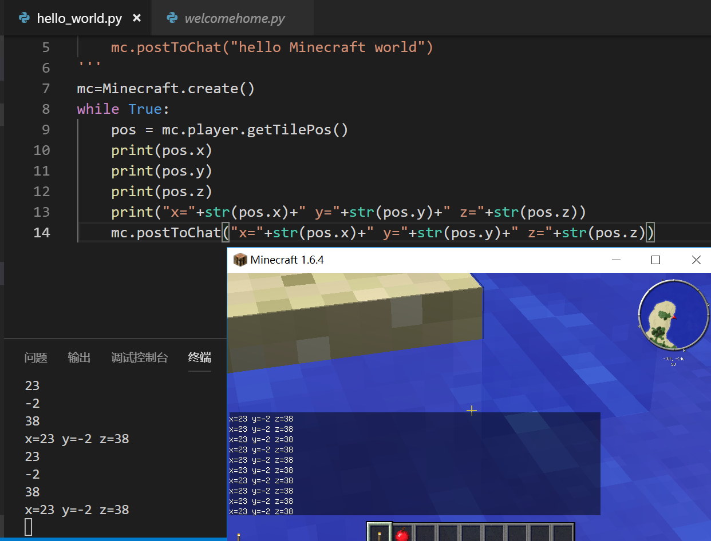
# 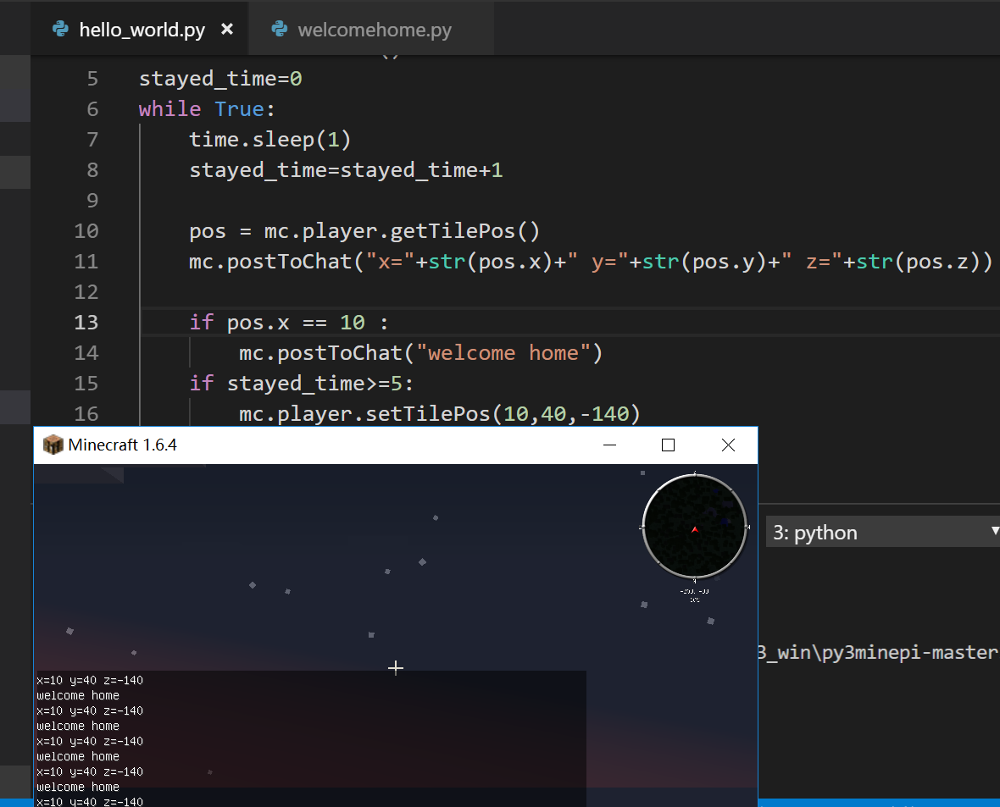

                                       
