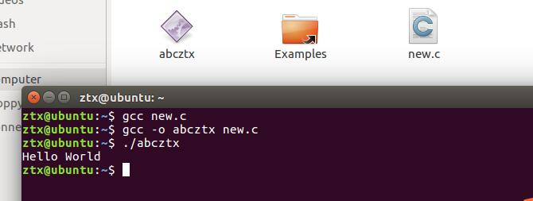
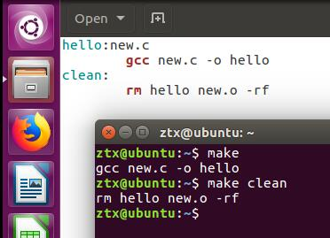
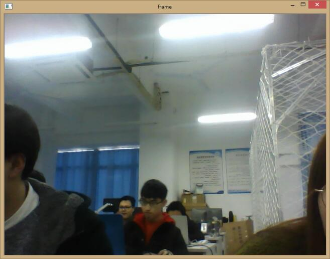
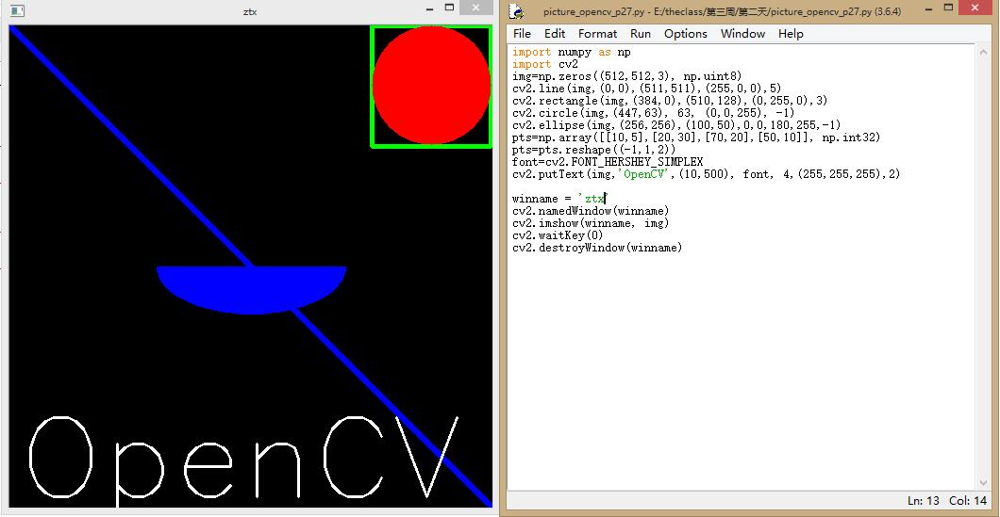
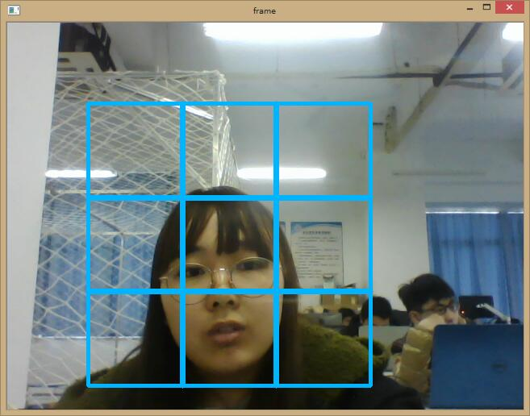
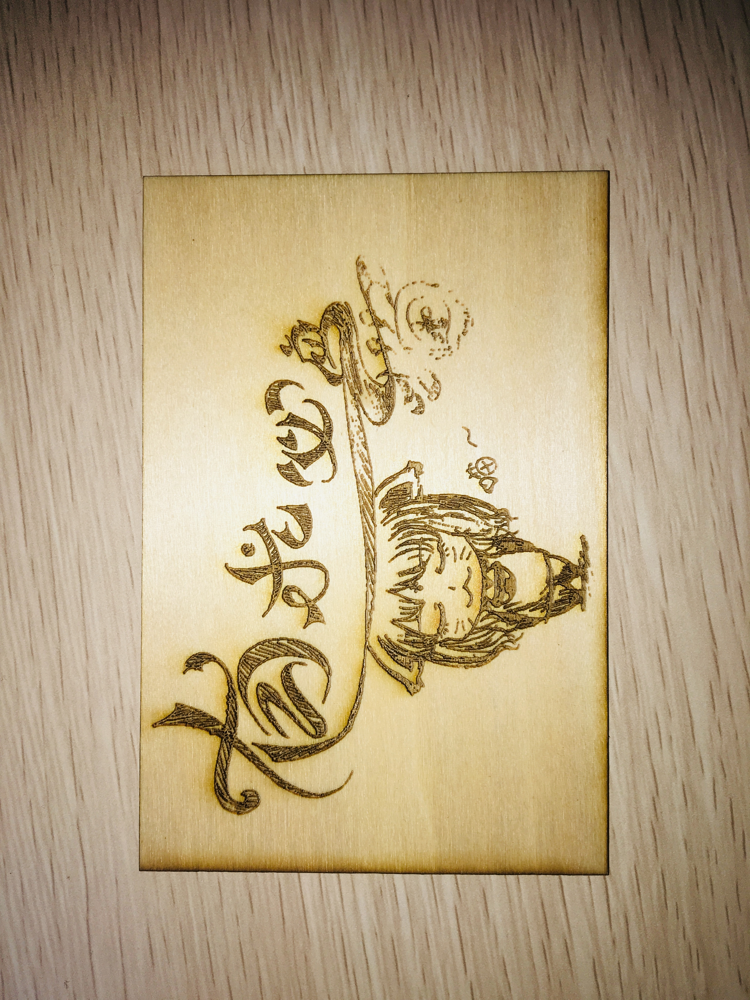
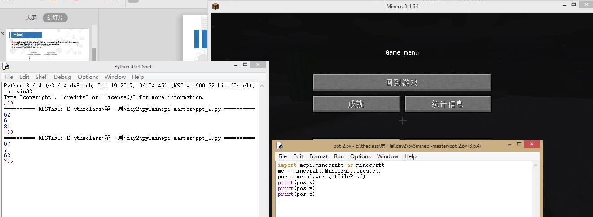
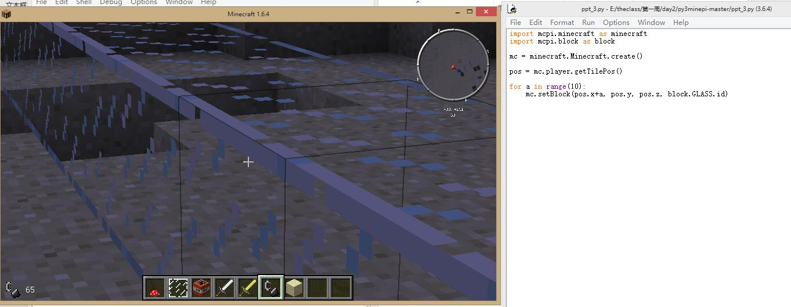
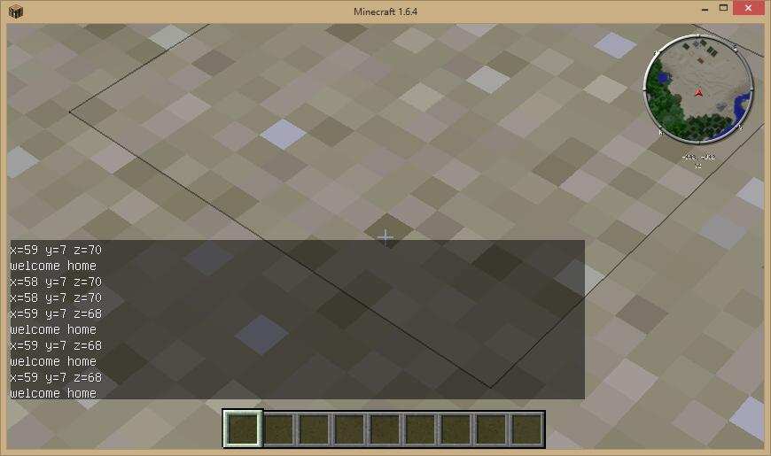

# 第三周任务——图片
# 第一天
# 第一步
# 
# Makefile
# 
# 用OpenCV拍视频
# 
# 第二天
# OpenCV画图
# 
# OpenCV视频中画九宫格
# 
# 激光雕刻作品
# 
# 第三天
# 我的世界_ppt2_获取坐标
# 
# 我的世界_我的坐标
# 
# 我的世界_helloworld
# 
# 我的世界_ppt3_自动放置物品
# 
# 我的世界_坐标显示+欢迎回家
# 
